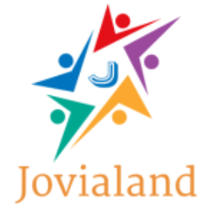
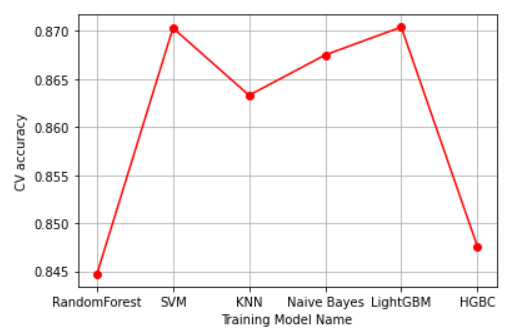

# CityHack22 Project Submission
## Project: Jovialand

## Team: Berrisa
## Members
-  CHENG Guo  (Leader)
-  WU Jianrui
-  YIN Yue
-  ZHANG Zirui
-  ZHAO Yuqiao

## Description of the Project (300 words)
Our Platform, Jovialand, is devoted to protecting children's mental health with cutting-edge techniques (including Artificial Intelligence, Augmented Reality, etc.) and various resources. Autism is what we mainly fight against currently. 

For the screening stage of autism, we apply state-of-the-art machine learning algorithm like LightGBM to help with early and accurate autism detection. Based on the available autism data, traditional methods of purely using questionnaires can only reach an accuracy of around 60%. With our developed machine learning model, we comprehensively analyze the questionnaire data, and the accuracy can reach over 85.6%. We expect the accuracy rate to have large improvement given larger dataset. With the profile system, Jovialand will give timely and personalized feedback to parents and help monitor their children’s conditions.

Our platform provides latest news and breakthrough in autism treatment and other information about children’s mental health. Besides, we build an “Jovialand” forum for parents who care about their children’s mental health, especially autism parents. They are free to share their life story of growing with their children, fighting against autism together, or any experience they would like to share. They may also ask for help from other parents. 

For the treatment stage of autism, Jovialand connects parents with experts in children mental health and autism. They can feel free to view the professionals’ profiles and make an appointment with them if necessary. Moreover, we plan to cooperate with other high-tech companies, e.g., Google, LuxAI, NTT Data to provide treatment services for children autism treatment. AR-based apps, interactive AI robots, and other services for autism prevention and treatment can be accessed via our platform.

Regards future development, we may expand our focus to more child mental disorders like, depression, ADHD, etc. The Jovialand platform’s ultimate goal is to build a caring hub for children’s mental health with advanced BioTech.

## 3 Most Impactful Features of the Project (with Screenshot and Short Description (150 words))
1. State-of-the-art machine learning techinques for early and accurate autism detection; Profile system to provide timely feedback to parents about children's mental health and monitor their conditions.

2. Information sharing platform to inform public of latest development and technical breakthrough in autism treatment; Online forum for autism parents to share their life stories with their children and ask for help.

3. Sophisticated and high-tech treatment services for autism children by connecting parents with experts in child autism and collaborating with AI companies to help with child autism treatment.

## Tech used (as many as required)
1. Machine Learning Techniques like LightGBM for autism screening
2. AI robots and AI-based services for child autism treatment
3. Augmented Reality for child autism treatment
4. Platform building with HTML, JavaScript, CSS, and backend server techniques

## Link
- < 3 minute Youtube Video Link for Project Demo >
